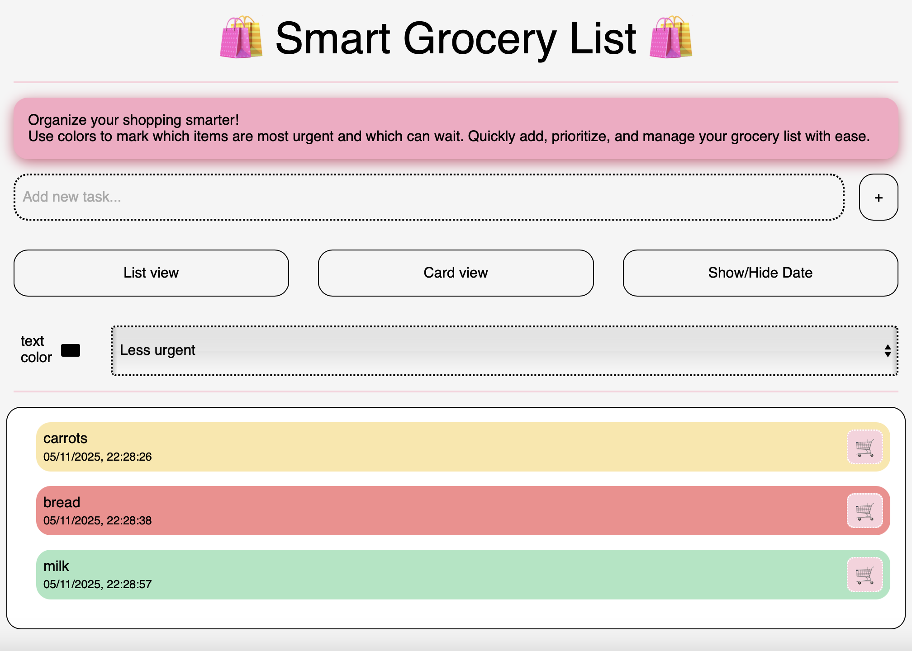

# Brief

Starting from the concept of a pinboard, implement a web page that:

- is responsive (properly layout for smartphone, tablet, and desktop)
- allows the user to add and remove elements
- allows the user to coustomize elements (i.e. colors, size)
- allows the switch between two views (at least)

# SCREENSHOTS

# PROJECT DESCRIPTION 

I created a website designed to be a smart shopping list to reduce waste when grocery shopping. The user can plan and prioritize their purchases, and once an item is bought, they can remove it from the list.

# FUNCTION LIST
The main implemented functions are the following:
- Switch to card view
- Switch to list view
- Add and depending on the user's input
- Remove card or list item 
- Create the date
- Display the creation date of the card or list item

All the function explained one by one:

- Switch to card view

cardButton.addEventListener('click', () => {...})
Switches the task display layout to card view by removing the list-view class and adding the card-view class to the task container.

- Switch to list view

listButton.addEventListener('click', () => {...})
Switches the task display layout to list view by removing the card-view class and adding the list-view class to the task container.

- Add card or list item depending on the user's input

addButton.addEventListener('click', () => {...})
Creates a new task item using the text entered by the user. The task includes customizable background and text color, the current date, and a delete button. The input field is cleared after adding. If the input is empty, no task is added.

- Remove card or list item 

deleteElement.addEventListener('click', () => {...})
Removes the selected task (li element) from the list when the delete button (🛒) is clicked.

- Display the creation date of the card or list item

toggleDateBtn.addEventListener('click', () => {...})
Toggles the visibility of task dates. It updates all elements with the .date-text class, showing or hiding them depending on the showDate flag.

- Create the date

In the addButton function, the current date is captured with:

const now = new Date();
dateElement.textContent = now.toLocaleString();

new Date() gets the exact current date and time, and .toLocaleString() converts it into a readable, localized format (e.g., “11/05/2025, 14:37”).
This value is then displayed in the task’s date element when the task is added.

