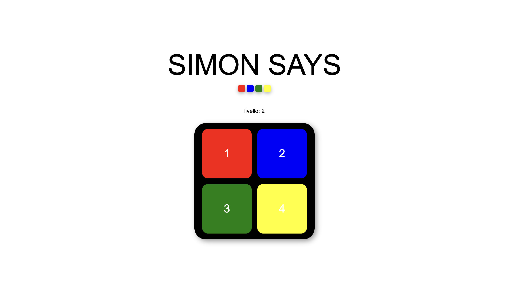
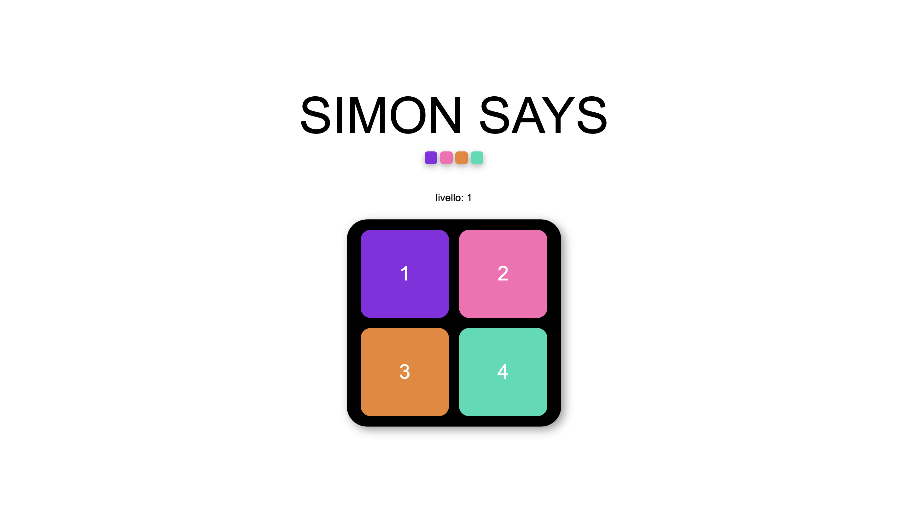
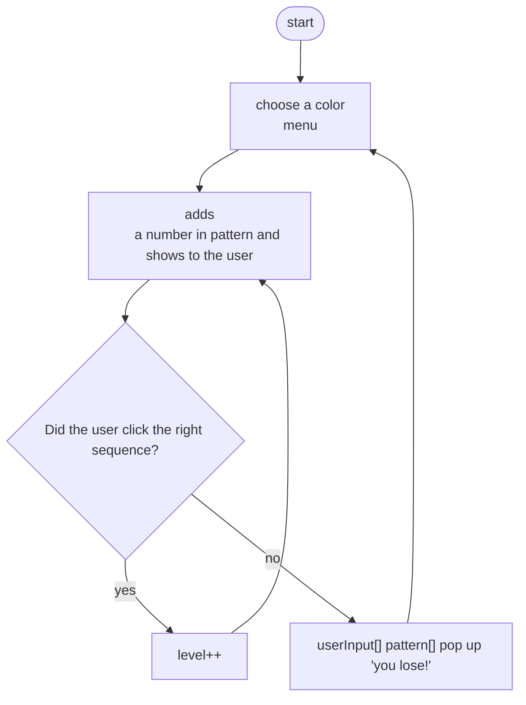

# Brief

Choose a “mini-game” to rebuild with HTML, CSS and JavaScript. The requirements are:

- The webpage should be responsive
- Choose an avatar at the beginning of the game
- Keep track of the score of the player
- Use the keyboard to control the game (indicate what are the controls in the page). You can also use buttons (mouse), but also keyboard.
- Use some multimedia files (audio, video, …)
- Implement an “automatic restart” in the game (that is not done via the refresh of the page)

# Screenshots

# Project description
Simon says memory game, where the system generates a sequence of colors and sounds that the player must repeat via clicks or keyboard input. Each level increases the pattern length. Features color customization, sound effects, a loss popup and a select color menu popup.

## Flowchart

# List of the functions

- updateButtonColors()

Updates the background colors of the four main buttons based on the selected color set (default or special).
It uses the currentColors array.

-  getPatternKey()

Generates a random number between 1 and 4 and adds it to the pattern sequence.
This creates the increasingly longer sequence that the player must memorize.

-  showPattern()

Displays the sequence that the player must repeat:

Iterates through all elements in the pattern.
For each number, finds the corresponding button and temporarily changes the button's color to white and plays the associated sound.
Restores the original color after 500ms.
Each step in the sequence is shown with a 1 second delay.

-  userClick(id)

Parameters: the ID of the button pressed, corresponding to "1", "2", "3", or "4".

Triggered when the user clicks a button or presses a key (1–4):
Adds the user's input to the userInput array.
Plays the sound for the selected button.
After the sound finishes, calls controllo() to verify the sequence.

-  controllo()

Checks whether the user’s sequence is correct.
Compares each user input element with the pattern:
If a value does not match the game is over, resets userInput and pattern and
shows the defeat popup with its sound.

If all the values match:
it clears userInput, increases the level and adds a new random number to the pattern.
shows the updated sequence.

- showColorPopup()

Displays the initial popup where the player chooses between 2 sets of colors and start the game.

- startGame()

Starts a new game and applies the selected colors to the buttons, resets level, pattern, and user input.
recalls getPatternKey() and showPattern() that creates and shows the sequence.

## Content and data sources

none

